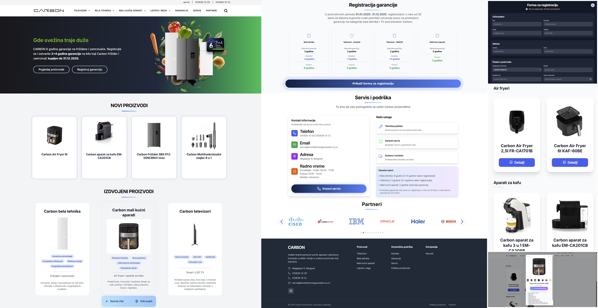

# Carbon Documentation

Welcome to the documentation for the Carbon project. 🌐 Visit our website at [carbon.co.rs](https://carbon.co.rs/) to learn more about our innovative solutions and services.

Dobrodošli u dokumentaciju za Carbon projekat.

# **🛍️ Carbon - Premium Home Appliances**

Welcome to the **Carbon** repository! 🎉 This modern web application showcases Carbon's premium line of home appliances, offering detailed product information, specifications, and warranty registration.

## **📌 Table of Contents**
- 📖 **[Overview](#overview)**
- 🚀 **[Features](#features)**
- 🧑‍💻 **[Technologies](#technologies)**
- 📸 **[Project Demo](#project-demo)**
- 🤝 **[Contributing](#contributing)**

## **Overview**
**Carbon** is a modern web application built to showcase and provide detailed information about Carbon's premium home appliances. The platform offers an intuitive interface for exploring product features, downloading specifications, and registering product warranties.

## **Features**
- 📱 **Responsive Design**: Fully responsive interface that works seamlessly across all devices
- 🔍 **Product Categories**: Easy navigation through different product categories:
  - 📺 **TVs & Entertainment**: Smart TV lineup including 32", 43", 50" and 65" models
  - ❄️ **Home Appliances**: Range of refrigerators including models DE2-34, DF2-28N, FF2-55N and freezer BE1-200
  - 🍳 **Small Kitchen Appliances**: Selection of small appliances including air fryers (2.5L, 6L) and coffee makers 
  - 💇‍♀️ **Beauty & Personal Care**: Beauty and care products including the 8-in-1 multifunctional hair styler
- 📄 **Product Details**: Comprehensive product information with high-quality images and specifications
- ⬇️ **PDF Downloads**: Easy access to product manuals and specification documents
- 📝 **Warranty Registration**: Simple and user-friendly warranty registration system
- 🔍 **Product Search**: Quick and efficient product search functionality

## **Technologies**
- ⚛️ **React + Vite**: Fast and modern frontend development setup
- 🎨 **Bootstrap**: Frontend framework for responsive design
- 📦 **MongoDB Atlas**: Cloud database hosting
- 🗄️ **MongoDB Compass**: Local development database tool
- 🖥️ **Node.js**: Backend runtime environment
- 🌐 **Express**: Web application framework for Node.js
- ☁️ **Render**: Backend API hosting
- 🖼️ **Cloudinary**: Cloud-based image management
- 🚀 **Vercel**: Frontend deployment platform
- 🌐 **cPanel**: Web hosting control panel
- 🔗 **Domain Management**: Custom domain configuration and management

## **Project Demo**

### 📸 **Application Screenshot**

### 🎥 **Video Demonstration**
Check out our video demonstration to see the Carbon application in action:

*Click the image above to watch the video demonstration*

## **Contributing**
- 🤝 Contributions are welcome! Please feel free to submit a pull request.
- 📝 Make sure to update tests as appropriate.
- 🐛 For major changes, please open an issue first to discuss what you would like to change.

3. **Required Environment Variables**
   - `MONGODB_URI`: Your MongoDB connection string
   - `CLOUDINARY_CLOUD_NAME`: Cloudinary cloud name
   - `CLOUDINARY_API_KEY`: Cloudinary API key
   - `CLOUDINARY_API_SECRET`: Cloudinary API secret
   - Additional variables as specified in `.env.example`

## **License**
This project is licensed under the MIT License - see the LICENSE file for details.

---
Made with ❤️ by Carbon Team
